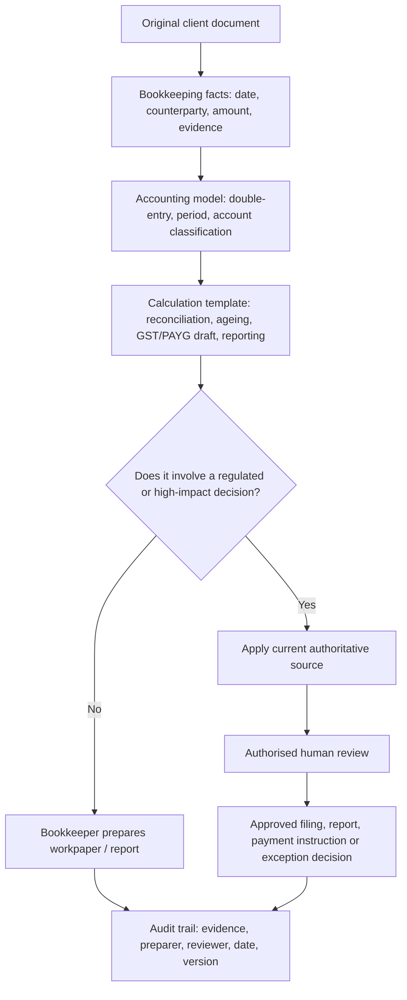
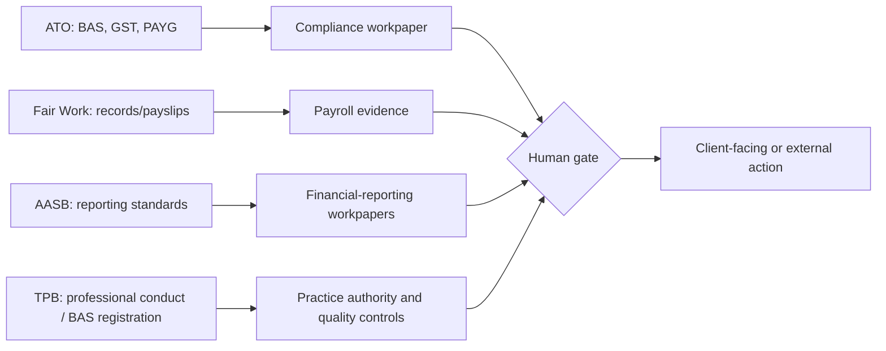

# Knowledge and Controls Map

The diagrams model information flow, not a substitute for current professional advice. The exact branch differs by entity, engagement scope, accounting basis, client approvals, software, and the practice's registration/supervision arrangements.
