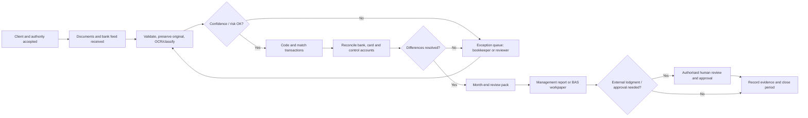
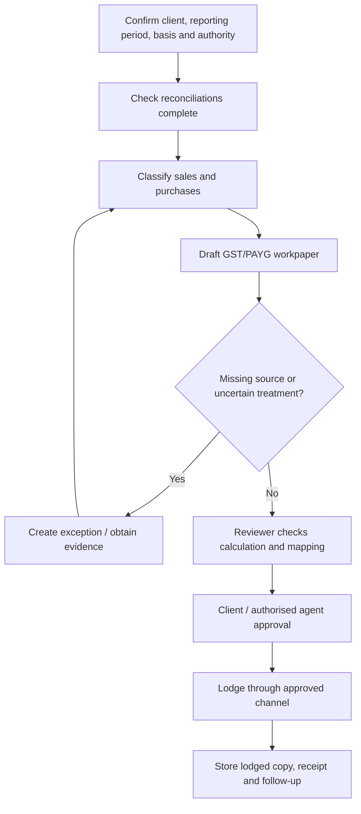
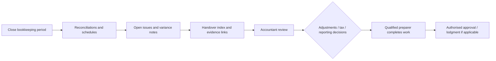

# Workflow Maps

These are reference models for a small practice. Real firms vary by client type, software, engagement scope, approval matrix, and registration status.

## A. Core bookkeeping cycle

## B. BAS workpaper control flow

## C. Year-end handover flow

